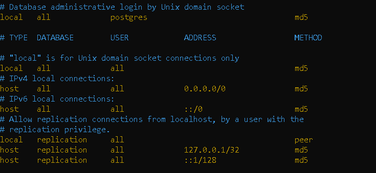

To Create Virtual environment for every project:

     C:\PycharmProjects\fastapi>py -3 -m venv venv

Install FastApi:

    pip install fastapi[all]
    check if email-validator not come with fastapi than ->
    pip install email-validator

To Check Installed Libs:

    pip freeze

To Start The WebServer:

    uvicorn Main:app (app is instance of fastapi in Main file)

To Reload The WebServer:

    uvicorn Main:app --reload
    uvicorn app.Main:app --reload -> app is python package here

To define Shcema:

    pydantic (it should be with fastapi libs)

To View documentation page of fastapi:

    http://127.0.0.1:8000/docs -> fastapi has built in swagger api support
    http://127.0.0.1:8000/redoc

To Install Oracle Libs:

    C:\PycharmProjects\fastapi> pip install cx_Oracle

To Install Postgres:

     pip install psycopg2
    
Python ORM:

    Sqlalchemy is one of the most popular python ORMs
    pip install sqlalchemy
    after install check driver for particular db

6:1:45 To Install passlib for hashing

     pip install passlib[bcrypt]

To install python-jose to generate and verify the JWT tokens in python

    pip install python-jose[cryptography]

8:17 8:38 9:05:
9:21 how to set db password in env variable 9:24:37 composite keys 9:34:59 vote route description 9:47:40 10:5 very good
join concept must revice time to time

10:15:30 join with sqlalchemy

10:31:50 new tool to add column in table because sqlalchemy don't allow to add new column

database tool migration

     pip install alembic
     PS C:\PycharmProjects\fastapi>alembic init alembic

CORS Concept

    11:14

To List Down all the libraries in a file

     pip freeze > requirement.txt
     pip install -r requirements.txt => to install all the libs

git remote add origin https://github.com/amit96java/fastapi.git
git branch -M main git push -u origin main

Heroku

    s

Ubuntu VM:

    sudo apt update && sudo apt upgrade -y
    amit@steve:~$ python3 --version
    pip --version
    pip3 --version
    sudo apt install python3-pip
    sudo pip3 install virtualenv
    sudo apt install postgresql postgresql-contrib -y
    psql --version
    psql --help
    psql -U postgres => login as postgres user
    whoami
    sudo cat /etc/passwd => to see users (postgres user created by postgres lib)
    sudo su
    root@steve:/home/amit# su - postgres
    psql -U postgres
    cd /etc/postgresql (whatever package installed in ubuntu , installed inside etc folder)
    To Restart Postgresql
         sudo /etc/init.d/postgresql restart
    To change password
    postgres=# \password postgres               (root)
    \q => to come out postgres command line

Set Config Files for postgres

    postgres@steve:~$ cd /etc/postgresql/12/main/
    postgres@steve:/etc/postgresql/12/main$ nano postgresql.conf
    Look for connections and authentication
        listen_addresses = '*' (* will allow to connect any postgres server not only localhost)
    nano pg_hba.conf
        chage local method from peer to md5
        # Database administrative login by Unix domain socket
        local   all             postgres                                md5
        
    after updating the file restart the postgres server.

12:17=> i'm unable to run postgres on ubuntu server

    solution: restart the postgres server.

13:04:49

    NGINX on ubuntu
        High performance webserver that can act as a proxy
        Can handle SSL termination

13:26:13

    Dockerize the application

13:48:34

    postgres container => very good container

To Install PyTest

    pip install pytest

14:36

15:37:25 (fixture)
16:07